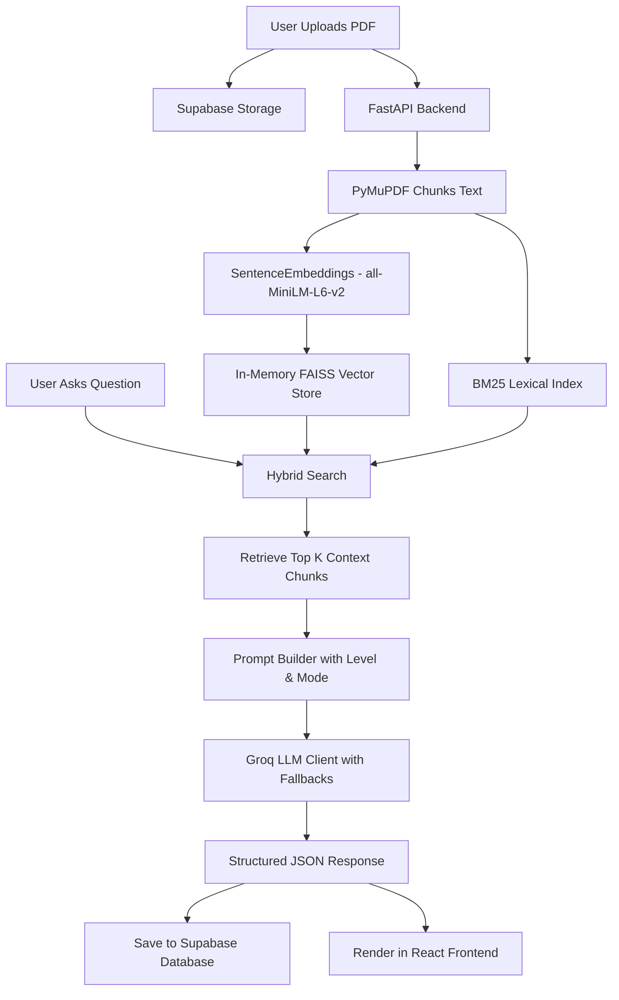

# PaperBrief 📄🚀

An AI-powered academic research assistant that uses **Retrieval-Augmented Generation (RAG)** with a **Hybrid Retrieval Pipeline (FAISS + BM25)** to answer questions, analyze concepts, and explain complex academic research papers directly from uploaded PDFs.

Built with a fast, modern **FastAPI** backend and a sleek, high-fidelity **React + Vite** frontend styled using **Tailwind CSS v4** and following **shadcn/ui** design patterns.

---

## 🛠️ System Architecture & RAG Pipeline

PaperBrief implements a robust, multi-tenant RAG pipeline leveraging both vector similarity and lexical matching to retrieve relevant context.



### 1. Document ingestion
- **Parsing**: Extracted text from uploaded PDFs using **PyMuPDF (`fitz`)**.
- **Section Detection**: Parses files using regex patterns matching capital titles to keep section metadata (e.g., `ABSTRACT`, `INTRODUCTION`).
- **Semantic Chunks**: Sentences are grouped into manageable windows (maximum 300 tokens) to preserve semantic coherence.

### 2. Hybrid Retrieval
- **Dense Vector Search**: Generates embedding vectors for each chunk using the `all-MiniLM-L6-v2` Sentence Transformer. Built in-memory via **FAISS** for fast similarity lookup.
- **Sparse Keyword Search**: Constructs a lexical index using **Rank-BM25**.
- **Fusion**: Merges results from both dense and sparse indexes to cover queries requiring conceptual understanding as well as exact keyword matching.

### 3. Structured Generation
- **Level customizer**: Tailors explanations to three academic demographics:
  - `Beginner (10 year old)`: Uses analogies, simple terms, and short sentences.
  - `College Student`: Balanced technical depth, standard definitions, and academic accuracy.
  - `Researcher (Expert)`: Precise, rigorous academic language, formal derivations, and references to page numbers.
- **Study Modes**:
  - `Standard`: Concise structural answers.
  - `Equation Breakdown`: Detailed explanation of mathematical equations and variables.
  - `Paper Analysis`: Detailed critical analysis of the paper's strengths, assumptions, and limitations.
- **Structured JSON Schema**: Prompts the LLM (hosted on Groq) to return JSON with structured fields: `main_idea`, `key_concepts`, `equations_explained`, `real_world_example`, and `simple_summary`.
- **Model Fallbacks**: Automatically falls back across a chain of Groq LLMs (`llama-3.3-70b-versatile`, `llama-3.1-8b-instant`, etc.) to guarantee high availability.

---

## ⚡ Key Features

- **Multi-Tenant Document Library**: Upload, organize, and delete research papers. File validation restricts sizes up to 20MB.
- **Interactive Chat Workspace**: A split-screen layout displaying document meta-context on one side and a fully feature-rich AI chat interface on the other.
- **Customizable Explanations**: Select explanation levels (10-year-old, College Student, Researcher) and study modes (Standard, Equation, Analysis) on the fly.
- **Persistent Chat History**: Session threads are saved to Supabase and can be loaded dynamically from the History panel.
- **JWT Authorization**: Secure routes validated via asymmetric **ES256** keys loaded from Supabase's JWKS endpoint (falling back to legacy **HS256** if configured).

---

## 💻 Tech Stack

### Backend
- **FastAPI**: Asynchronous web framework for high-performance APIs.
- **PyMuPDF (fitz)**: High-speed PDF text and structural layout extraction.
- **FAISS (CPU)**: In-memory vector database for semantic search.
- **Rank-BM25**: Lexical/keyword retrieval.
- **Sentence Transformers**: `all-MiniLM-L6-v2` local model for embedding generation.
- **PyJWT**: Secure verification of Supabase auth tokens.
- **Supabase Python SDK**: Storage uploads and metadata database transactions.

### Frontend
- **React (v19)**: Component-based user interface.
- **Vite**: Ultra-fast build tool and development server.
- **Tailwind CSS v4**: Utility-first CSS styling.
- **Supabase JS Client**: Direct frontend user registration, login, and session handling.
- **Lucide React**: Clean, modern iconography.
- **Axios**: HTTP client for API interactions.

---

## 📁 Repository Structure

```
PaperBrief/
├── backend/                   # FastAPI Server
│   ├── app/
│   │   ├── api/              # API Endpoints (documents, chat, deps)
│   │   ├── core/             # App configs, security/JWT decoders
│   │   ├── models/           # Pydantic schemas (Query schemas)
│   │   ├── services/         # Core RAG, indexes, parsers, and DB records
│   │   │   ├── bm25_index.py
│   │   │   ├── chunker.py
│   │   │   ├── embeddings.py
│   │   │   ├── faiss_index.py
│   │   │   ├── groq_client.py
│   │   │   ├── hybrid_retriever.py
│   │   │   ├── pdf_parser.py
│   │   │   ├── prompt_builder.py
│   │   │   ├── records.py
│   │   │   └── storage_service.py
│   │   ├── supabase_client.py # Client initialization
│   │   └── main.py           # Application entry point
│   ├── requirements.txt      # Python dependencies
│   └── .env.example          # Template for backend env variables
│
├── frontend/                  # React Single Page App (SPA)
│   ├── src/
│   │   ├── components/       # Reusable layout and UI components
│   │   ├── lib/              # Supabase Client instantiation
│   │   ├── pages/            # View pages (Login, Dashboard, ChatWorkspace, Upload)
│   │   ├── routes/           # React Router declarations (AppRoutes)
│   │   ├── services/         # Axios API connection endpoints
│   │   ├── App.jsx           # Main App wrapper
│   │   ├── index.css         # Styling styles
│   │   └── main.jsx          # DOM rendering entry point
│   ├── package.json          # Node dependencies
│   ├── vite.config.js        # Vite configurations
│   └── .env.example          # Template for frontend env variables
│
└── readme.md                  # This file
```

---

## 💾 Supabase Database Schema

To run PaperBrief with persistence, create a Supabase project and execute the following SQL DDL in your **Supabase SQL Editor**:

```sql
-- 1. Enable UUID Extension
CREATE EXTENSION IF NOT EXISTS "uuid-ossp";

-- 2. Create Documents Table
CREATE TABLE public.documents (
    id UUID PRIMARY KEY DEFAULT gen_random_uuid(),
    user_id UUID NOT NULL,
    filename TEXT NOT NULL,
    storage_path TEXT NOT NULL,
    file_size_bytes BIGINT NOT NULL,
    status TEXT NOT NULL CHECK (status IN ('processing', 'ready', 'failed')),
    page_count INTEGER,
    uploaded_at TIMESTAMPTZ DEFAULT now()
);

-- 3. Create Chat Sessions Table
CREATE TABLE public.chat_sessions (
    id UUID PRIMARY KEY DEFAULT gen_random_uuid(),
    user_id UUID NOT NULL,
    document_id UUID REFERENCES public.documents(id) ON DELETE CASCADE NOT NULL,
    title VARCHAR(255) NOT NULL,
    created_at TIMESTAMPTZ DEFAULT now()
);

-- 4. Create Chat Messages Table
CREATE TABLE public.chat_messages (
    id UUID PRIMARY KEY DEFAULT gen_random_uuid(),
    session_id UUID REFERENCES public.chat_sessions(id) ON DELETE CASCADE NOT NULL,
    role TEXT NOT NULL CHECK (role IN ('user', 'assistant')),
    content TEXT NOT NULL,
    created_at TIMESTAMPTZ DEFAULT now()
);

-- 5. Indexes for fast retrieval
CREATE INDEX idx_documents_user ON public.documents(user_id);
CREATE INDEX idx_chat_sessions_user ON public.chat_sessions(user_id);
CREATE INDEX idx_chat_messages_session ON public.chat_messages(session_id);
```

### 🪣 Supabase Storage Configuration
1. Go to your **Supabase Dashboard** -> **Storage**.
2. Create a new bucket named **`pdfs`**.
3. Set the bucket privacy to **Private**.

---

## 🚀 Getting Started

### 📋 Prerequisites
- Python 3.9+
- Node.js 18+
- A [Supabase](https://supabase.com) account
- A [Groq](https://console.groq.com) account (for LLM generations)

---

### 1️⃣ Backend Setup

1. Navigate to the backend directory:
   ```bash
   cd backend
   ```
2. Create a virtual environment and activate it:
   ```bash
   # Windows
   python -m venv venv
   .\venv\Scripts\activate

   # macOS/Linux
   python3 -m venv venv
   source venv/bin/activate
   ```
3. Install the dependencies:
   ```bash
   pip install -r requirements.txt
   ```
4. Create a `.env` file from the example:
   ```bash
   cp .env.example .env
   ```
5. Configure your `.env` variables:
   ```env
   GROQ_API_KEY=your_groq_api_key
   SUPABASE_URL=https://your-project-ref.supabase.co
   SUPABASE_KEY=your_supabase_service_role_key   # NOT the anon key
   SUPABASE_JWT_SECRET=your_supabase_jwt_secret   # From API settings page
   SUPABASE_STORAGE_BUCKET=pdfs
   ```
6. Run the FastAPI development server:
   ```bash
   uvicorn app.main:app --reload --host 0.0.0.0 --port 8000
   ```

---

### 2️⃣ Frontend Setup

1. Navigate to the frontend directory:
   ```bash
   cd ../frontend
   ```
2. Install the node packages:
   ```bash
   npm install
   ```
3. Create a `.env` file from the example:
   ```bash
   cp .env.example .env
   ```
4. Configure your `.env` variables:
   ```env
   VITE_SUPABASE_URL=https://your-project-ref.supabase.co
   VITE_SUPABASE_ANON_KEY=your_supabase_anon_public_key
   ```
5. Start the Vite development server:
   ```bash
   npm run dev
   ```
6. Open your browser and navigate to `http://localhost:5173` (or the port specified by Vite).

---

## 🎯 Example Flow

1. **Sign Up / Sign In**: Register a new user account (credentials are stored securely in Supabase Auth).
2. **Upload a Paper**: Upload an academic paper (.pdf format). The application will extract content, run semantic + lexical indexing, and store it in your Library.
3. **Select Options**: Choose your level (e.g., `10 year old` for conceptual explanations, or `Researcher` for deep academic context) and study mode.
4. **Chat**: Query the paper. You will receive structured responses containing high-level ideas, concept breakdowns, simple summaries, and mathematical details.